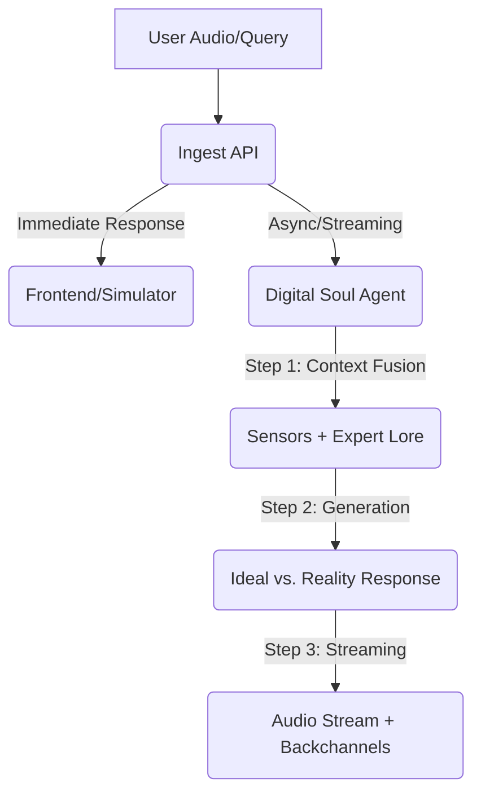

# Smart Plant Pot Backend

A voice-enabled IoT backend for an ESP32-powered smart plant pot. Powered by FastAPI, LangGraph, and Google Vertex AI.

## Agentic Infrastructure

The backend uses a streamlined **Digital Soul** architecture. Instead of multiple jumping between nodes, a unified agent manages intent, sensor awareness, and botanical expertise in a single pass. This significantly reduces latency while maintaining high intelligence.

### Conversation Flow


### Core Features
- **Unified Digital Soul**: A single-node agent that correlates current physical sensations (Temperature, Moisture, Light) with expert botanical lore.
- **Ideal vs. Reality Structure**: For health and care queries, the plant leads with the botanical "Ideal" (Expert Lore) before stating its current "Reality" (Sensors), providing clear, actionable advice.
- **Low-Latency Streaming**: Responses are streamed sentence-by-sentence. A verbal backchannel ("Hmm... let me see") triggers immediately to mask processing time.
- **Natural Persona**: The plant speaks naturally, avoiding technical sensor names in its spoken responses while still being technically accurate about its needs.

## Prerequisites
- Python 3.9+
- API Keys: Google Gemini / Vertex AI (for LLM, STT, and TTS)

## Setup

1. **Clone and Install Dependencies**
   ```bash
   pip install -r requirements.txt
   ```

2. **Configure Environment**
   Copy `.env.example` to `.env` and fill in your API keys.
   ```bash
   cp .env.example .env
   ```
   
   **Key Descriptions:**
   - `GOOGLE_API_KEY`: A single key used for the multi-agent system (LLM), Google Cloud STT, and Google Cloud TTS.

3. **Database Initialization**
   The database (SQLite by default) will be automatically created on the first run.

## Running the Server
```bash
python main.py
# or
uvicorn main:app --reload
```

## Testing & Simulation

### 1. Web Simulator
Open `http://localhost:8000/simulator/index.html` in your browser to interact with the plant using your microphone and simulated sensor sliders.

### 2. Manual Simulation Script
To simulate a device sending structured data:
```bash
python tests/simulate_device.py
```

## Example Test Queries

Try asking these questions to see how the agents coordinate:

- **Health Checks**:
  - "Hey plant, how are you feeling?"
  - "Do you need more water?"
  - "Are the conditions in this room okay for you?"
- **Plant Knowledge**:
  - "What kind of plant are you?"
  - "How much sunlight should you be getting?"
  - "What's the ideal temperature for a Basil plant?"
- **Personality & Interaction**:
  - "Tell me a joke about plants."
  - "Good morning! Did you sleep well?"
  - "Who is your favorite gardener?"

## What to Test

1. **API Connectivity**: Confirm the server responds to `/health` with `status: healthy`.
2. **STT Accuracy**: Verify your speech is correctly transcribed in the server logs.
3. **Audio Streaming**: Ensure the audio starts with a verbal backchannel ("Hmm...") and flows smoothly sentence-by-sentence.
4. **Ideal vs. Reality Logic**: Ask "How are you feeling?" or "Are you getting enough light?" and verify the plant states its botanical ideal before its current sensor reading.

## Project Structure
- `agents/`: Implementation of the **Digital Soul** (ConversationAgent).
- `services/`: STT, TTS, and storage management.
- `models.py`: Database schemas and seeding logic for botanical lore.
- `main.py`: FastAPI endpoints, streaming logic, and ingest pipeline.
- `audio_artifacts/`: Local storage for voice recordings and backchannels.
- `simulator/`: Web-based interaction frontend.

## Hardware Setup & ESP32 Code

To build the physical Smart Plant Pot, you will need:
- **MCU**: ESP32-C3 Super Mini
- **Temperature**: DS18B20 (1-Wire)
- **Moisture**: Capacitive Soil Moisture Sensor (Analog)
- **Audio In**: INMP441 or similar I2S Microphone
- **Audio Out**: MAX98357A I2S DAC + 8Ω Speaker

### 1. Wiring Diagram (ESP32-C3 Super Mini)

| Component | ESP32-C3 Pin | Note |
| :--- | :--- | :--- |
| **DS18B20 (Data)** | GPIO 1 | Requires 4.7kΩ pull-up to 3.3V |
| **Soil Moisture (Aout)**| GPIO 0 (A0) | Analog Input |
| **I2S Mic (SCK)** | GPIO 2 | Clock |
| **I2S Mic (WS)** | GPIO 3 | Word Select |
| **I2S Mic (SD)** | GPIO 10 | Serial Data |
| **MAX98357A (LRC)** | GPIO 4 | Word Select / LR Clock |
| **MAX98357A (BCLK)** | GPIO 5 | Bit Clock |
| **MAX98357A (DIN)** | GPIO 6 | Data In |

### 2. Assembly Steps
1. **Power**: Connect 3.3V and GND from the ESP32-C3 to all sensors. The MAX98357A can be connected to the 5V pin for higher volume.
2. **Sensors**: Place the DS18B20 (Temperature) and Soil Moisture sensor in the pot.
3. **Small Form Factor**: The C3 Super Mini is very small, so careful soldering or use of a breadboard is recommended.

### 3. ESP32 Arduino Sketch
Install these libraries in the Arduino IDE:
- `OneWire` & `DallasTemperature`
- `ArduinoJson`
- `ESP32-audioI2S` (Ensure version 3.0+ for C3 support)

```cpp
#include <WiFi.h>
#include <HTTPClient.h>
#include <ArduinoJson.h>
#include <OneWire.h>
#include <DallasTemperature.h>
#include "Audio.h"

// --- CONFIGURATION ---
const char* ssid = "YOUR_WIFI_SSID";
const char* password = "YOUR_WIFI_PASSWORD";
const char* serverUrl = "http://<YOUR_SERVER_IP>:8000/v1/ingest";
const char* deviceId = "pot_c3_mini";

// --- PINS (Optimized for C3 Super Mini) ---
#define ONE_WIRE_BUS 1
#define MOISTURE_PIN 0
#define I2S_SPEAKER_BCLK 5 
#define I2S_SPEAKER_LRC 4
#define I2S_SPEAKER_DIN 6
// Note: Mic uses SCK(2), WS(3), SD(10) - defined in your recording logic

OneWire oneWire(ONE_WIRE_BUS);
DallasTemperature sensors(&oneWire);
Audio audio;

void setup() {
  Serial.begin(115200);
  WiFi.begin(ssid, password);
  while (WiFi.status() != WL_CONNECTED) delay(500);
  
  sensors.begin();
  audio.setPinout(I2S_SPEAKER_BCLK, I2S_SPEAKER_LRC, I2S_SPEAKER_DIN);
  audio.setVolume(12);
}

void loop() {
  sensors.requestTemperatures();
  float temp = sensors.getTempCByIndex(0);
  int moistureRaw = analogRead(MOISTURE_PIN);
  float moisture = map(moistureRaw, 3000, 1000, 0, 100);

  if (Serial.read() == 's') {
    sendData(temp, moisture, 5.0); 
  }
  
  audio.loop();
}

void sendData(float temp, float moisture, float light) {
  HTTPClient http;
  String url = String(serverUrl) + "?device_id=" + deviceId + 
               "&temperature=" + String(temp) + 
               "&moisture=" + String(moisture) + 
               "&light=" + String(light);
               
  http.begin(url);
  int httpCode = http.POST("");
  
  if (httpCode == 200) {
    String payload = http.getString();
    StaticJsonDocument<512> doc;
    deserializeJson(doc, payload);
    const char* audioUrl = doc["audio_url"];
    
    String fullAudioUrl = "http://<YOUR_SERVER_IP>:8000" + String(audioUrl);
    audio.connecttohost(fullAudioUrl.c_str());
  }
  http.end();
}
```

## Hardware Integration Guide

To connect your real ESP32 sensors and microphone to this backend:

### 1. Ingest Data
Send a `POST` request to `http://<YOUR_SERVER_IP>:8000/v1/ingest` with `device_id`, `temperature`, `moisture`, `light`, and an `audio` file (16kHz WAV).

### 2. Stream Response
The `/v1/ingest` endpoint returns a JSON immediately with a `audio_url` (e.g., `/v1/audio/stream/123`). 
- **Streaming**: The `ESP32-audioI2S` library handles the `audio_url` directly. It will stream and play the audio chunks in real-time.
- **Immediate Playback**: The plant's "Hmm..." backchannel will play as soon as the stream starts, followed by the actual answer.

### 3. Parse Metadata
Use `GET /v1/history?device_id=<ID>` after the audio finishes to retrieve the final `reply_text` and `mood` for your display/LCD face.
