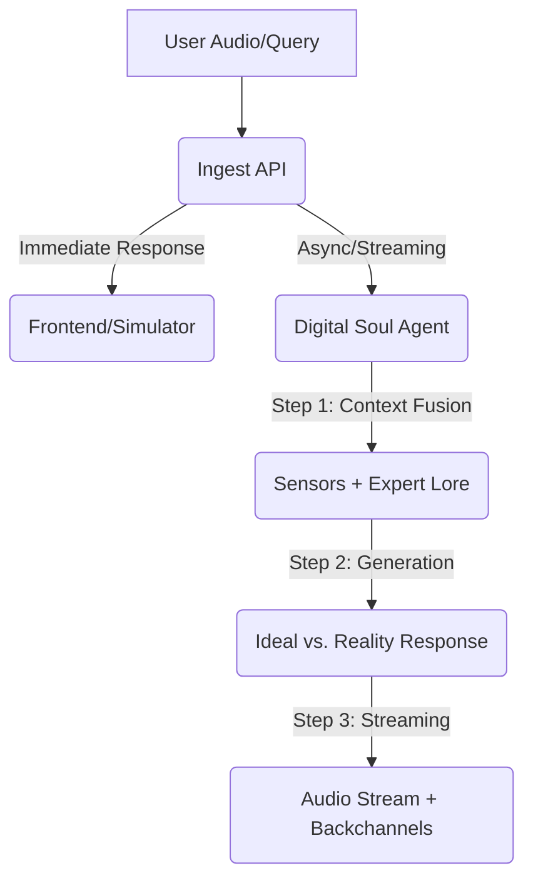

# Smart Plant Pot Backend

A voice-enabled IoT backend for an ESP32-powered smart plant pot. Powered by FastAPI, LangGraph, and Google Vertex AI.

## Agentic Infrastructure

The backend uses a streamlined **Digital Soul** architecture. Instead of multiple jumping between nodes, a unified agent manages intent, sensor awareness, and botanical expertise in a single pass. This significantly reduces latency while maintaining high intelligence.

### Conversation Flow


### Core Features
- **Unified Digital Soul**: A single-node agent that correlates current physical sensations (Temperature, Moisture, Light) with expert botanical lore.
- **Ideal vs. Reality Structure**: For health and care queries, the plant leads with the botanical "Ideal" (Expert Lore) before stating its current "Reality" (Sensors), providing clear, actionable advice.
- **Low-Latency Streaming**: Responses are streamed sentence-by-sentence. A verbal backchannel ("Hmm... let me see") triggers immediately to mask processing time.
- **Natural Persona**: The plant speaks naturally, avoiding technical sensor names in its spoken responses while still being technically accurate about its needs.

## Prerequisites
- Python 3.9+
- API Keys: Google Gemini / Vertex AI (for LLM, STT, and TTS)

## Setup

1. **Clone and Install Dependencies**
   ```bash
   pip install -r requirements.txt
   ```

2. **Configure Environment**
   Copy `.env.example` to `.env` and fill in your API keys.
   ```bash
   cp .env.example .env
   ```
   
   **Key Descriptions:**
   - `GOOGLE_API_KEY`: A single key used for the multi-agent system (LLM), Google Cloud STT, and Google Cloud TTS.

3. **Database Initialization**
   The database (SQLite by default) will be automatically created on the first run.

## Running the Server
```bash
python main.py
# or
uvicorn main:app --reload
```

## Testing & Simulation

### 1. Web Simulator
Open `http://localhost:8000/simulator/index.html` in your browser to interact with the plant using your microphone and simulated sensor sliders.

### 2. Manual Simulation Script
To simulate a device sending structured data:
```bash
python tests/simulate_device.py
```

## Example Test Queries

Try asking these questions to see how the agents coordinate:

- **Health Checks**:
  - "Hey plant, how are you feeling?"
  - "Do you need more water?"
  - "Are the conditions in this room okay for you?"
- **Plant Knowledge**:
  - "What kind of plant are you?"
  - "How much sunlight should you be getting?"
  - "What's the ideal temperature for a Basil plant?"
- **Personality & Interaction**:
  - "Tell me a joke about plants."
  - "Good morning! Did you sleep well?"
  - "Who is your favorite gardener?"

## What to Test

1. **API Connectivity**: Confirm the server responds to `/health` with `status: healthy`.
2. **STT Accuracy**: Verify your speech is correctly transcribed in the server logs.
3. **Audio Streaming**: Ensure the audio starts with a verbal backchannel ("Hmm...") and flows smoothly sentence-by-sentence.
4. **Ideal vs. Reality Logic**: Ask "How are you feeling?" or "Are you getting enough light?" and verify the plant states its botanical ideal before its current sensor reading.

## Project Structure
- `agents/`: Implementation of the **Digital Soul** (ConversationAgent).
- `services/`: STT, TTS, and storage management.
- `models.py`: Database schemas and seeding logic for botanical lore.
- `main.py`: FastAPI endpoints, streaming logic, and ingest pipeline.
- `audio_artifacts/`: Local storage for voice recordings and backchannels.
- `simulator/`: Web-based interaction frontend.

## Hardware Setup & ESP32 Code

To build the physical Smart Plant Pot, you will need:
- **MCU**: ESP32-C3 Super Mini
- **Temperature**: DS18B20 (1-Wire)
- **Moisture**: Capacitive Soil Moisture Sensor (Analog)
- **Audio In**: INMP441 or similar I2S Microphone
- **Audio Out**: MAX98357A I2S DAC + 8Ω Speaker

### 1. Wiring Diagram (ESP32-C3 Super Mini)

| Component | ESP32-C3 Pin | Note |
| :--- | :--- | :--- |
| **DS18B20 (Data)** | GPIO 1 | Requires 4.7kΩ pull-up to 3.3V |
| **Soil Moisture (Aout)**| GPIO 0 (A0) | Analog Input |
| **I2S Mic (SCK)** | GPIO 2 | Clock |
| **I2S Mic (WS)** | GPIO 3 | Word Select |
| **I2S Mic (SD)** | GPIO 10 | Serial Data |
| **MAX98357A (LRC)** | GPIO 4 | Word Select / LR Clock |
| **MAX98357A (BCLK)** | GPIO 5 | Bit Clock |
| **MAX98357A (DIN)** | GPIO 6 | Data In |

### 2. Assembly Steps
1. **Power**: Connect 3.3V and GND from the ESP32-C3 to all sensors. The MAX98357A can be connected to the 5V pin for higher volume.
2. **Sensors**: Place the DS18B20 (Temperature) and Soil Moisture sensor in the pot.
3. **Small Form Factor**: The C3 Super Mini is very small, so careful soldering or use of a breadboard is recommended.

### 3. ESP32 PlatformIO Project

Create a new PlatformIO project in VS Code for the **ESP32-C3** and use the following configuration and code.

#### `platformio.ini`
Add these dependencies to your project configuration:
```ini
[env:esp32-c3-devkitm-1]
platform = espressif32
board = esp32-c3-devkitm-1
framework = arduino
monitor_speed = 115200
lib_deps =
    esphome/ESP32-audioI2S @ ^2.0.7
    WiFi
    HTTPClient
    paulstoffregen/OneWire @ ^2.3.7
    milesburton/DallasTemperature @ ^3.9.1
    bblanchon/ArduinoJson @ ^6.21.3
build_flags =
    -D CORE_DEBUG_LEVEL=3
    -D ARDUINO_USB_MODE=1
    -D ARDUINO_USB_CDC_ON_BOOT=1
    -std=gnu++2a


lib_ldf_mode = deep+
```

#### `src/main.cpp`
```cpp
#include <Arduino.h>
#include <WiFi.h>
#include <WiFiMulti.h>
#include <HTTPClient.h>
#include <ArduinoJson.h>
#include <OneWire.h>
#include <DallasTemperature.h>
#include <Audio.h>
#include <esp_wifi.h> // Required for driver-level WiFi control


// WiFiMulti wifiMulti; // Simplified to direct WiFi.begin for better iPhone compatibility

// --- CONFIGURATION ---
#include "secrets.h"
const char* serverUrl = "http://172.20.10.4:8000/v1/ingest";
const char* deviceId = "c3_mini_plant_pot";

// --- PINS (Optimized for C3 Super Mini) ---
#define ONE_WIRE_BUS 1
#define MOISTURE_PIN 0
#define I2S_SPEAKER_BCLK 5
#define I2S_SPEAKER_LRC 4
#define I2S_SPEAKER_DIN 6

OneWire oneWire(ONE_WIRE_BUS);
DallasTemperature sensors(&oneWire);
Audio audio;

// Helper function to decode WiFi status codes
String getWiFiStatus(wl_status_t status) {
  switch(status) {
    case WL_IDLE_STATUS:        return "WL_IDLE_STATUS";
    case WL_NO_SSID_AVAIL:      return "WL_NO_SSID_AVAIL (SSID not found)";
    case WL_SCAN_COMPLETED:     return "WL_SCAN_COMPLETED";
    case WL_CONNECTED:          return "WL_CONNECTED";
    case WL_CONNECT_FAILED:     return "WL_CONNECT_FAILED (check SSID/password)";
    case WL_CONNECTION_LOST:    return "WL_CONNECTION_LOST";
    case WL_DISCONNECTED:       return "WL_DISCONNECTED";
    case WL_NO_SHIELD:          return "WL_NO_SHIELD";
    default:                    return "UNKNOWN_STATUS";
  }
}

void sendData(float temp, float moisture, float light) {
  HTTPClient http;
  String url = String(serverUrl) + "?device_id=" + deviceId + 
               "&temperature=" + String(temp) + 
               "&moisture=" + String(moisture) + 
               "&light=" + String(light);

  Serial.printf("Sending data to %s\n", url.c_str());
  http.begin(url);
  int httpCode = http.POST("");
  
  if (httpCode == 200) {
    String payload = http.getString();
    StaticJsonDocument<512> doc;
    deserializeJson(doc, payload);
    const char* audioUrl = doc["audio_url"];
    
    // Construct the full URL using the server base (avoiding hardcoded IP in multiple places)
    String serverBase = String(serverUrl).substring(0, String(serverUrl).indexOf("/v1/"));
    String fullAudioUrl = serverBase + String(audioUrl);
    
    Serial.printf("Streaming response: %s\n", fullAudioUrl.c_str());
    audio.connecttohost(fullAudioUrl.c_str());
  } else {
    Serial.printf("POST failed, error: %s (httpCode: %d)\n", http.errorToString(httpCode).c_str(), httpCode);
  }
  http.end();
}

void setup() {
  Serial.begin(115200);
  delay(10); 

  // --- CRITICAL: Stabilize radio BEFORE connection ---
  WiFi.mode(WIFI_STA);
  WiFi.setSleep(false);    // Disable power save to prevent AUTH_EXPIRE
  // WiFi.setTxPower(WIFI_POWER_19_5dBm); 
  
  // Force WPA2/Disable Power Save to avoid iPhone WPA3/PMF transition issues
  // This is a common fix for "Reason: 2 - AUTH_EXPIRE"
  esp_wifi_set_ps(WIFI_PS_NONE);
  
  delay(1000); // Allow WiFi driver to stabilize before scanning/connecting

  Serial.println("\n=== WiFi Debugging Info ===");

  // --- Scan available networks ---
  Serial.println("Scanning WiFi networks...");
  int n = WiFi.scanNetworks();
  Serial.print("Networks found: "); Serial.println(n);

  if (n == 0) {
    Serial.println("ERROR: No WiFi networks found! Check if hotspot is enabled.");
  } else {
    Serial.println("\nAvailable networks:");
    for (int i = 0; i < n; i++) {
      Serial.print("  ["); Serial.print(i); Serial.print("] ");
      Serial.print(WiFi.SSID(i));
      Serial.print(" (RSSI: "); Serial.print(WiFi.RSSI(i)); Serial.print(" dBm)");
      
      uint8_t sec = WiFi.encryptionType(i);
      Serial.print(" [Encryption: ");
      switch(sec) {
        case WIFI_AUTH_OPEN:      Serial.print("OPEN"); break;
        case WIFI_AUTH_WEP:       Serial.print("WEP"); break;
        case WIFI_AUTH_WPA_PSK:   Serial.print("WPA_PSK"); break;
        case WIFI_AUTH_WPA2_PSK:  Serial.print("WPA2_PSK"); break;
        case WIFI_AUTH_WPA_WPA2_PSK: Serial.print("WPA/WPA2_PSK"); break;
        case WIFI_AUTH_WPA2_ENTERPRISE: Serial.print("WPA2_ENTERPRISE"); break;
        default:                  Serial.print("UNKNOWN"); break;
      }
      Serial.println("]");
    }
  }

  // --- Configure WiFi ---
  Serial.println("\n=== WiFi Connection Attempt ===");
  WiFi.disconnect(true);
  delay(100);

  Serial.print("Connecting to: '"); Serial.print(hotspot_ssid);
  Serial.print("' with password: "); Serial.println(hotspot_pass);
  
  WiFi.begin(hotspot_ssid, hotspot_pass);
  WiFi.setTxPower(WIFI_POWER_8_5dBm); 


  Serial.println("\nConnecting... (timeout: 40sec)");

  unsigned long startTime = millis();
  unsigned long timeout = 400; // 40 seconds
  int attemptCount = 0;

  while (WiFi.status() != WL_CONNECTED && (millis() - startTime < timeout)) {
    attemptCount++;

    // Print detailed info every 4 attempts (every 2 seconds)
    if (attemptCount % 4 == 0) {
      Serial.print("Attempt "); Serial.print(attemptCount);
      Serial.print(" | Status: "); Serial.print(getWiFiStatus(WiFi.status()));
      Serial.print(" | RSSI: "); Serial.print(WiFi.RSSI()); Serial.println(" dBm");
    } else {
      Serial.print("."); // keep showing activity
    }

    delay(500);
  }

  // Check final result
  if (WiFi.status() == WL_CONNECTED) {
    Serial.println("\nWiFi Connected!");
    Serial.print("Connected SSID: "); Serial.println(WiFi.SSID());
    Serial.print("IP Address: "); Serial.println(WiFi.localIP());
    Serial.print("Signal Strength: "); Serial.print(WiFi.RSSI()); Serial.println(" dBm");
  } else {
    Serial.println("\nWiFi Connection FAILED!");
    Serial.print("Final Status: "); Serial.println(getWiFiStatus(WiFi.status()));
    Serial.println("Troubleshooting:");
    Serial.print("  - Expected SSID: '"); Serial.print(hotspot_ssid); Serial.println("'");
    Serial.println("  - Ensure hotspot is ON and using 2.4 GHz (ESP32-C3 cannot use 5 GHz)");
    Serial.println("  - Check spelling and password in secrets.h");
  }

  Serial.print("Configured (primary) SSID: "); Serial.println(hotspot_ssid);

  // --- Init sensors and audio ---
  sensors.begin();
  audio.setPinout(I2S_SPEAKER_BCLK, I2S_SPEAKER_LRC, I2S_SPEAKER_DIN);
  audio.setVolume(12);
}

void loop() {
  sensors.requestTemperatures();
  float temp = sensors.getTempCByIndex(0);
  int moistureRaw = analogRead(MOISTURE_PIN);
  float moisture = map(moistureRaw, 3000, 1000, 0, 100);

  if (Serial.available() && Serial.read() == 's') {
    sendData(temp, moisture, 5.0);
  }

  audio.loop();
}
```

### Troubleshooting: No Serial Output
If nothing is printed in the Monitor after uploading:

1. **USB Cable**: Many cables are "Charge Only". Ensure you are using a **Data Sync** cable.
2. **Baud Rate**: Ensure the **PlatformIO Serial Monitor** is set to `115200`. (Check `monitor_speed = 115200` in `platformio.ini`).
3. **USB CDC On Boot**: Since the ESP32-C3 Super Mini uses an internal USB Serial, you may need to add this to your `platformio.ini`:
   ```ini
   build_flags = 
       -D ARDUINO_USB_MODE=1
       -D ARDUINO_USB_CDC_ON_BOOT=1
   ```
### 6. Troubleshooting "No matching WiFi found"
If the monitor says `[E] no matching wifi found!`:

1. **iPhone Hotspot Name**: iPhone hotspots often use a curly apostrophe (**`’`**) instead of a straight one (**`'`**). Check your "Available networks" list in the Serial Monitor. If it says `Yi Siang’s iPhone`, update your `secrets.h` to match **exactly**.
2. **Maximize Compatibility**: On your iPhone, go to **Settings -> Personal Hotspot** and turn on **"Maximize Compatibility"**. This is required to enable the 2.4GHz signal that the ESP32 uses.
3. **SSID Case Sensitivity**: Ensure your `hotspot_ssid` in `secrets.h` matches the casing (e.g., `iPhone` vs `iphone`) seen in the scan results.
4. **Distance**: Ensure your ESP32 is within 2 meters of your laptop/hotspot during setup.

### 7. Troubleshooting "Reason: 2 - AUTH_EXPIRE"
This means the iPhone timed out waiting for the ESP32 to authenticate.
1. **Forget & Reset**: On your iPhone, go to **Settings -> WiFi**, find your hotspot (or your laptop's connection), and tap **"Forget This Network"**. Then toggle the Hotspot OFF and ON again.
2. **Maximize Compatibility**: Double-check that **"Maximize Compatibility"** is ON. If it was already ON, try toggling it OFF and back ON.
3. **Power Cycle**: Unplug the ESP32, wait 5 seconds, and plug it back in. Handshake errors often persist across soft-restarts.
4. **SSID Simplification (Recommended)**: The curly apostrophe (**`’`**) is a nightmare for ESP32. If it still fails, change your iPhone name (**Settings -> General -> About -> Name**) to something simple like **`TestPot`** (no spaces, no symbols). This is the #1 way to fix all connection issues instantly.

### 8. Troubleshooting "Reason: 202 - AUTH_FAIL"
This is a standard "Wrong Password" or "Mismatched SSID" error.
1. **SSID Exact Match**: Looking at your Serial log, your iPhone name is actually **`Yi Siang’s iPhone`**. Your code had `iphone` (lower case) and a straight `'`. You **MUST** copy the name exactly as it appears in the "Available networks" scan list.
2. **Password Verification**: Re-type your password in `secrets.h` to ensure there are no trailing spaces or typos.

## Getting Started with Hardware

Follow these steps to get your physical Smart Plant Pot online and connected to the backend:

### 1. Start the Backend Server
Ensure your backend server is running and accessible from your local network:
```bash
python main.py
```
*Note: Make sure your ESP32 and the computer running the backend are on the **same WiFi network**.*

### 2. Configure project
1. Open the project folder in **VS Code** with the **PlatformIO** extension installed.
2. **Create `include/secrets.h`**: 
   Inside your PlatformIO project, create a file named `secrets.h` in the `include` folder and paste this:
   ```cpp
   #ifndef SECRETS_H
   #define SECRETS_H
   const char* hotspot_ssid = "Yi Siang’s iPhone"; // NOTE: USE THE CURLY ’ AND CAPITAL I/P
   const char* hotspot_pass = "addyisslim";
   #endif
   ```
3. **Find your Server IP**: 
   The ESP32 needs to know your laptop's address. Open a terminal on your laptop and type:
   - **Windows**: `ipconfig` (Look for "IPv4 Address" under your WiFi adapter, e.g., `192.168.1.50`)
   - **Mac/Linux**: `ifconfig` or `hostname -I`
4. **Update `src/main.cpp`**: 
   Replace `10.32.12.233` in `serverUrl` with your actual laptop IP:
   `const char* serverUrl = "http://192.168.x.x:8000/v1/ingest";`
5. Ensure `platformio.ini` matches your hardware (the provided config works for C3 Super Mini).

> **Note on IntelliSense Errors**: If VS Code shows a red squiggly line under `#include <Audio.h>`, it's likely because the library hasn't been downloaded yet. To fix this:
> 1. Click the **Build** button (check-mark icon in the bottom bar). This will download the libraries.
> 2. After building, if the error persists, open the PlatformIO sidebar (ant icon) and select **Miscellaneous -> Rebuild IntelliSense Index**.

### 3. Upload to ESP32-C3
1. Connect your ESP32-C3 Super Mini to your computer via USB.
2. Click the **PlatformIO icon** (the ant head) in the sidebar.
3. Select **Upload and Monitor** for your environment.

### 4. Start the Interaction
1. Once the monitor opens and connects to WiFi, type the letter **`s`** into the terminal and press **Enter**.
2. This will trigger the sensor reading and data ingestion.
3. You should hear the plant's "Hmm..." backchannel immediately through the speaker, followed by its expert botanical advice!

### 5. Verifying the Connection
How to tell if your hardware is correctly communicating with the backend:

- **Check PlatformIO Serial Monitor**: You should see "WiFi Connected" and then `httpCode: 200` after pressing 's'. If the code is `-1`, the ESP32 can't reach your computer (check IP address or firewall).
- **Watch Backend Logs**: The terminal running `main.py` will print:
  `DEBUG: Received Ingest - Device: pot_c3_mini, Text: None, Audio: None`
  If you see this, the connection is successful!
- **Speaker Check**: If the connection goes through, the ESP32 will immediately print `audio_url`. The `audio.loop()` will then start playing the "Hmm..." sound.
- **Ping Test**: From your computer, try to `ping <ESP32_IP>` (the IP is printed in the **PlatformIO Serial Monitor** on boot) to ensure they can "see" each other.

### 6. Monitor Logs
Check the backend terminal to see the incoming requests from the ESP32 and the AI agent's decision-making process.

## Hardware Integration Guide

To connect your real ESP32 sensors and microphone to this backend:

### 1. Ingest Data
Send a `POST` request to `http://<YOUR_SERVER_IP>:8000/v1/ingest` with `device_id`, `temperature`, `moisture`, `light`, and an `audio` file (16kHz WAV).

### 2. Stream Response
The `/v1/ingest` endpoint returns a JSON immediately with a `audio_url` (e.g., `/v1/audio/stream/123`). 
- **Streaming**: The `ESP32-audioI2S` library handles the `audio_url` directly. It will stream and play the audio chunks in real-time.
- **Immediate Playback**: The plant's "Hmm..." backchannel will play as soon as the stream starts, followed by the actual answer.

### 3. Parse Metadata
Use `GET /v1/history?device_id=<ID>` after the audio finishes to retrieve the final `reply_text` and `mood` for your display/LCD face.
