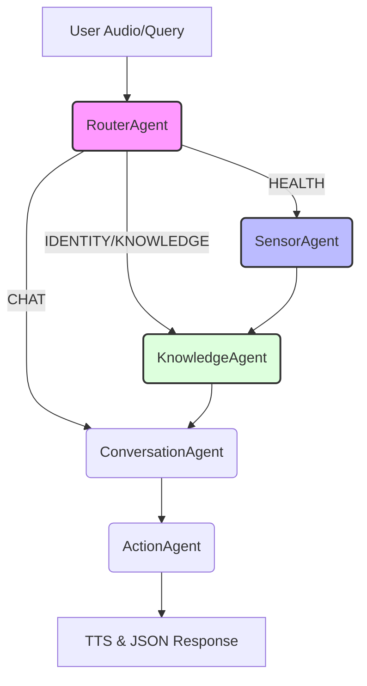

# Smart Plant Pot Backend

A voice-enabled IoT backend for an ESP32-powered smart plant pot. Powered by FastAPI, LangGraph, and Google Vertex AI.

## Agentic Infrastructure

The backend uses a multi-agent system powered by **LangGraph** to coordinate between specialized AI models. This ensures high-quality, intent-aware responses while maintaining strict data boundaries.

### Conversation Flow


### Core Agents
- **RouterAgent**: Categorizes user intent (IDENTITY, HEALTH, KNOWLEDGE, CHAT). This prevents "data leakage"—for example, the plant won't talk about its physical sensors when asked about its history.
- **SensorAgent**: Translates raw numerical data (moisture, temp) into physical "sensations" (e.g., "roots are parched").
- **KnowledgeAgent**: Retrieves biological facts, species lore, and care tips based on the selected plant species.
- **ConversationAgent**: The "soul" of the plant. Expresses thoughts with a witty, poetic, and slightly sarcastic personality.
- **ActionAgent**: Finalizes the technical response (mood, icons, priority) for the device.

## Prerequisites
- Python 3.9+
- API Keys: Google Gemini / Vertex AI (for LLM, STT, and TTS)

## Setup

1. **Clone and Install Dependencies**
   ```bash
   pip install -r requirements.txt
   ```

2. **Configure Environment**
   Copy `.env.example` to `.env` and fill in your API keys.
   ```bash
   cp .env.example .env
   ```
   
   **Key Descriptions:**
   - `GOOGLE_API_KEY`: A single key used for the multi-agent system (LLM), Google Cloud STT, and Google Cloud TTS.

3. **Database Initialization**
   The database (SQLite by default) will be automatically created on the first run.

## Running the Server
```bash
python main.py
# or
uvicorn main:app --reload
```

## Testing & Simulation

### 1. Web Simulator
Open `http://localhost:8000/simulator/index.html` in your browser to interact with the plant using your microphone and simulated sensor sliders.

### 2. Manual Simulation Script
To simulate a device sending structured data:
```bash
python tests/simulate_device.py
```

## Example Test Queries

Try asking these questions to see how the agents coordinate:

- **Health Checks**:
  - "Hey plant, how are you feeling?"
  - "Do you need more water?"
  - "Are the conditions in this room okay for you?"
- **Plant Knowledge**:
  - "What kind of plant are you?"
  - "How much sunlight should you be getting?"
  - "What's the ideal temperature for a Basil plant?"
- **Personality & Interaction**:
  - "Tell me a joke about plants."
  - "Good morning! Did you sleep well?"
  - "Who is your favorite gardener?"

## What to Test

1. **API Connectivity**: Confirm the server responds to `/health` with `status: healthy`.
2. **STT Accuracy**: Verify your speech is correctly transcribed in the server logs.
3. **Response Audio**: Ensure the generated WAV is 16kHz Mono and audible in the simulator.
4. **Agent Logic**: Check if the "Knowledge Agent" provides accurate advice based on your current sensor readings.

## Project Structure
- `agents/`: LangGraph orchestration and individual AI agents.
- `services/`: STT, TTS, and storage management.
- `models.py`: Database schemas.
- `main.py`: FastAPI endpoints and integration.
- `audio_artifacts/`: Local storage for voice recordings and responses.
- `simulator/`: Web-based interaction frontend.

## Hardware Integration Guide

To connect your real ESP32 sensors and microphone to this backend:

### 1. API Endpoint
Send a `POST` request to `http://<YOUR_SERVER_IP>:8000/v1/ingest`.

### 2. Payload Format (Multipart/Form-Data)
The hardware must send data as a "multipart/form-data" request containing:

- **Query Parameters**:
  - `device_id` (string): Unique ID of your pot.
  - `temperature` (float): Reading in Celsius.
  - `moisture` (float): Soil moisture percentage (0-100).
  - `light` (float): Light level (lux or percentage).
  - `event` (optional string): "wake_word" if triggered by local detection.

- **File Upload (Audio)**:
  - Key: `audio`
  - Format: **16-bit PCM WAV at 16000Hz** (Essential for Google STT).
  - Audio content should be the voice command recorded by the ESP32.

### 3. Handling the Response
The server returns a JSON object. Your ESP32 should interpret/parse:
- `reply_text`: The text to display on any screen.
- `audio_url`: URL to download the response audio (WAV). Download and play this via I2S (MAX98357A).
- `display.mood`: Update your e-paper/LCD face based on this (e.g., 'thirsty', 'happy').
