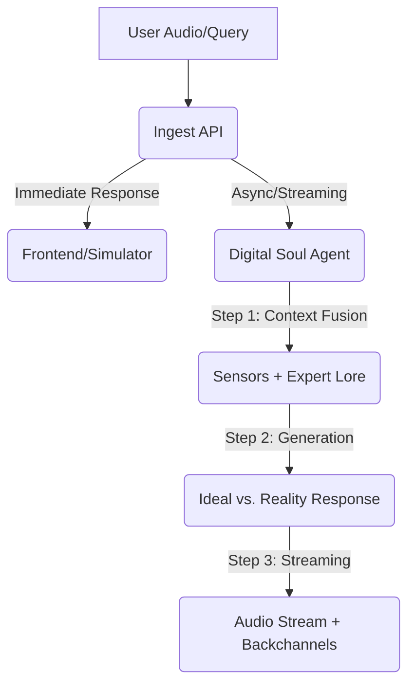

# Smart Plant Pot Backend

A voice-enabled IoT backend for an ESP32-powered smart plant pot. Powered by FastAPI, LangGraph, and Google Vertex AI.

## Agentic Infrastructure

The backend uses a streamlined **Digital Soul** architecture. Instead of multiple jumping between nodes, a unified agent manages intent, sensor awareness, and botanical expertise in a single pass. This significantly reduces latency while maintaining high intelligence.

### Conversation Flow


### Core Features
- **Unified Digital Soul**: A single-node agent that correlates current physical sensations (Temperature, Moisture, Light) with expert botanical lore.
- **Ideal vs. Reality Structure**: For health and care queries, the plant leads with the botanical "Ideal" (Expert Lore) before stating its current "Reality" (Sensors), providing clear, actionable advice.
- **Low-Latency Streaming**: Responses are streamed sentence-by-sentence. A verbal backchannel ("Hmm... let me see") triggers immediately to mask processing time.
- **Natural Persona**: The plant speaks naturally, avoiding technical sensor names in its spoken responses while still being technically accurate about its needs.

## Prerequisites
- Python 3.9+
- API Keys: Google Gemini / Vertex AI (for LLM, STT, and TTS)

## Setup

1. **Clone and Install Dependencies**
   ```bash
   pip install -r requirements.txt
   ```

2. **Configure Environment**
   Copy `.env.example` to `.env` and fill in your API keys.
   ```bash
   cp .env.example .env
   ```
   
   **Key Descriptions:**
   - `GOOGLE_API_KEY`: A single key used for the multi-agent system (LLM), Google Cloud STT, and Google Cloud TTS.

3. **Database Initialization**
   The database (SQLite by default) will be automatically created on the first run.

## Running the Server
```bash
python main.py
# or
uvicorn main:app --reload
```

## Testing & Simulation

### 1. Web Simulator
Open `http://localhost:8000/simulator/index.html` in your browser to interact with the plant using your microphone and simulated sensor sliders.

### 2. Manual Simulation Script
To simulate a device sending structured data:
```bash
python tests/simulate_device.py
```

## Example Test Queries

Try asking these questions to see how the agents coordinate:

- **Health Checks**:
  - "Hey plant, how are you feeling?"
  - "Do you need more water?"
  - "Are the conditions in this room okay for you?"
- **Plant Knowledge**:
  - "What kind of plant are you?"
  - "How much sunlight should you be getting?"
  - "What's the ideal temperature for a Basil plant?"
- **Personality & Interaction**:
  - "Tell me a joke about plants."
  - "Good morning! Did you sleep well?"
  - "Who is your favorite gardener?"

## What to Test

1. **API Connectivity**: Confirm the server responds to `/health` with `status: healthy`.
2. **STT Accuracy**: Verify your speech is correctly transcribed in the server logs.
3. **Audio Streaming**: Ensure the audio starts with a verbal backchannel ("Hmm...") and flows smoothly sentence-by-sentence.
4. **Ideal vs. Reality Logic**: Ask "How are you feeling?" or "Are you getting enough light?" and verify the plant states its botanical ideal before its current sensor reading.

## Project Structure
- `agents/`: Implementation of the **Digital Soul** (ConversationAgent).
- `services/`: STT, TTS, and storage management.
- `models.py`: Database schemas and seeding logic for botanical lore.
- `main.py`: FastAPI endpoints, streaming logic, and ingest pipeline.
- `audio_artifacts/`: Local storage for voice recordings and backchannels.
- `simulator/`: Web-based interaction frontend.

## Hardware Integration Guide

To connect your real ESP32 sensors and microphone to this backend:

### 1. Ingest Data
Send a `POST` request to `http://<YOUR_SERVER_IP>:8000/v1/ingest` with `device_id`, `temperature`, `moisture`, `light`, and an `audio` file (16kHz WAV).

### 2. Stream Response
The `/v1/ingest` endpoint returns a JSON immediately with a `audio_url` (e.g., `/v1/audio/stream/123`). 
- **Streaming**: Open a GET request to that URL. The server will stream the audio chunks using a standard `audio/wav` media type.
- **Immediate Playback**: Your hardware can start playing the first chunk of audio as soon as it arrives, significantly reducing perceived latency.

### 3. Parse Metadata
Use `GET /v1/history?device_id=<ID>` after the audio finishes to retrieve the final `reply_text` and `mood` for your display.
